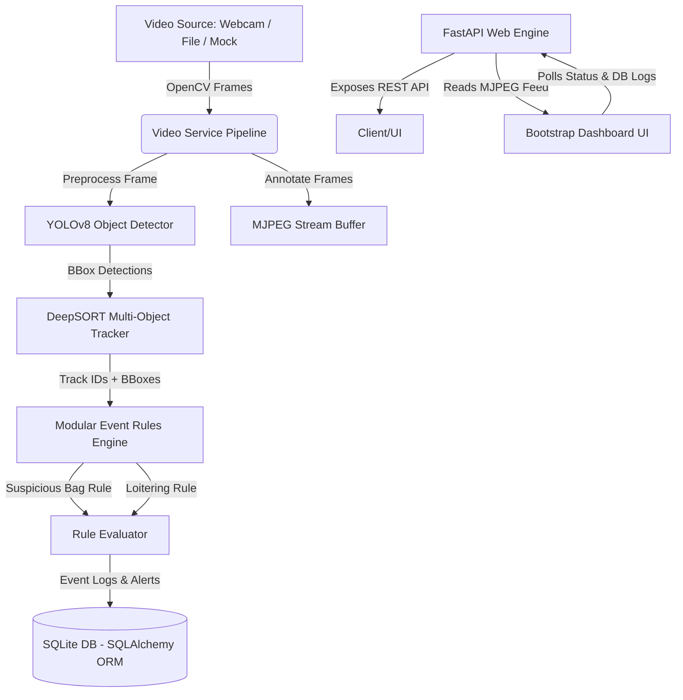

# SentinelAI — Multi-Source Video Analysis and Interpretation System

SentinelAI is a production-style real-time video analytics platform built to ingest camera feeds, perform AI-powered object detection and tracking, evaluate security-event rules, write audit trails to databases, and expose administration APIs and live-monitoring dashboards.

---

## Architecture & Data Flow



### Component Overview

1. **Video Ingestion Layer** (`app/services/video_service.py`)
   - Manages a thread-safe frame acquisition loop using OpenCV.
   - Decoupled into background execution to prevent blocking the web server.
   - Seamlessly supports physical webcams, static local MP4 files, or a synthetic "Mock" source with moving targets for instant out-of-the-box verification.

2. **Object Detection Module** (`app/detection/detector.py`)
   - Integrates **YOLOv8** (Ultralytics) pretrained on the COCO dataset.
   - Specifically filters for security classes of interest: `Person` (0), `Backpack` (24), `Handbag` (26), and `Suitcase` (28).
   - Configurable confidence thresholding via environment variables.

3. **Object Tracking Module** (`app/tracking/tracker.py`)
   - Integrates **DeepSORT** (`deep-sort-realtime`) using MobileNet feature embeddings.
   - Tracks objects across frames and assigns consistent tracking IDs to maintain state.

4. **Modular Event Engine** (`app/events/`)
   - Runs a decoupled rules processor executing modular, isolated logic classes:
     - **Suspicious Object Presence** (`app/events/rules/suspicious_bag.py`): Alerts when a person and a bag (backpack, handbag, suitcase) are detected simultaneously.
     - **Loitering Detection** (`app/events/rules/loitering.py`): Alerts when the same tracked person ID remains visible on-screen for more than 20 seconds.
   - Employs alert throttling (cooldowns & track-ID-based caching) to prevent database flooding.

5. **FastAPI Web Server** (`app/api/` & `app/main.py`)
   - Exposes REST endpoints to query metrics, system health, starts/stops the stream asynchronously, and fetches event logs.
   - Delivers live annotated visual analysis using an **MJPEG multipart stream** endpoint.

6. **Web Dashboard** (`app/dashboard/`)
   - Designed with a high-end, responsive dark Bootstrap interface.
   - Displays real-time streaming annotations, tracking stats, system latency, active alerts, and database logs using lightweight client-side polling.

---

## Folder Structure

```
sentinel-ai/
├── app/
│   ├── api/             # FastAPI REST endpoints & MJPEG generator
│   │   └── endpoints.py
│   ├── core/            # System config, logger init
│   │   ├── config.py
│   │   └── logging.py
│   ├── dashboard/       # Front-end components & templates
│   │   └── templates/
│   │       └── index.html
│   ├── database/        # Database initialization & schemas
│   │   ├── models.py
│   │   └── session.py
│   ├── detection/       # YOLOv8 wrappers
│   │   └── detector.py
│   ├── tracking/        # DeepSORT tracker integration
│   │   └── tracker.py
│   ├── events/          # Rules engine & custom rules
│   │   ├── base_rule.py
│   │   ├── engine.py
│   │   └── rules/
│   │       ├── suspicious_bag.py
│   │       └── loitering.py
│   ├── models/          # Pydantic schemas (Swagger/REST validation)
│   │   └── schemas.py
│   └── services/        # OpenCV background thread executor
│       └── video_service.py
├── videos/              # Video volume mount
├── logs/                # Application logs mount
│   └── app.log
├── tests/               # Test suites
│   ├── test_endpoints.py
│   └── test_rules.py
├── Dockerfile           # Docker configuration
├── docker-compose.yml   # Orchestration definition
├── requirements.txt     # Python requirements
└── README.md            # System Documentation
```

---

## Getting Started

### Prerequisites
- Docker & Docker Compose installed.

### Quick Start (Docker Compose)
To compile and start the entire platform, run:
```bash
docker compose up --build
```
Once initialized, access:
- **Dashboard UI**: `http://localhost:8000/`
- **Swagger Documentation**: `http://localhost:8000/docs`

---

## Configuration (`.env` or Environment Variables)

The following parameters can be customized in `docker-compose.yml` or set in a `.env` file at the root:

| Variable | Default | Description |
|---|---|---|
| `VIDEO_SOURCE` | `mock` | Stream input. Can be `mock`, `0` (webcam), or path like `videos/cctv_feed.mp4`. |
| `CONFIDENCE_THRESHOLD` | `0.45` | YOLOv8 minimum class confidence. |
| `DATABASE_URL` | `sqlite:///sentinel.db` | SQLAlchemy connection string. |
| `LOG_LEVEL` | `INFO` | Logger verbosity (`DEBUG`, `INFO`, `WARNING`, `ERROR`). |

### Running a custom Video File
1. Place your MP4 video file inside the local `videos/` folder (e.g. `videos/office.mp4`).
2. Update the environment variable `VIDEO_SOURCE=videos/office.mp4` in `docker-compose.yml`.
3. Restart composition: `docker compose up`.

---

## REST API Reference

| Method | Endpoint | Description |
|---|---|---|
| **GET** | `/api/health` | Perform system health check. |
| **GET** | `/api/stream-status` | Fetch the current state and FPS of the stream. |
| **POST** | `/api/start-stream` | Start background video ingestion thread. |
| **POST** | `/api/stop-stream` | Stop background video ingestion thread. |
| **GET** | `/api/stream/video_feed` | Retrieve live annotated MJPEG stream. |
| **GET** | `/api/events` | Query recent security events from the database. |
| **GET** | `/api/alerts` | Query recent triggered alerts. |

---

## Future-Ready Production Design

SentinelAI is architected to scale from a single-camera MVP to an enterprise multi-source grid:

```
                  ┌──────────────┐   ┌──────────────┐
                  │ CCTV Feed 01 │   │ CCTV Feed 02 │
                  └──────┬───────┘   └──────┬───────┘
                         │                  │
                         ▼                  ▼
                  ┌──────────────┐   ┌──────────────┐
                  │ Ingestion    │   │ Ingestion    │
                  │ Worker 01    │   │ Worker 02    │
                  └──────┬───────┘   └──────┬───────┘
                         │                  │
                         ▼                  ▼
                  ┌─────────────────────────────────┐
                  │      Apache Kafka Broker        │
                  └────────────────┬────────────────┘
                                   │
             ┌─────────────────────┴─────────────────────┐
             ▼                                           ▼
      ┌──────────────┐                            ┌──────────────┐
      │ ML Inference │                            │ Event & Rule │
      │ Worker (GPU) │                            │ Engine (CPU) │
      └──────┬───────┘                            └──────┬───────┘
             │                                           │
             ▼                                           ▼
      ┌──────────────┐                            ┌──────────────┐
      │ Redis Cache  │                            │ PostgreSQL DB│
      └──────────────┘                            └──────────────┘
```

1. **Multi-Camera Grid Scaling**: Ingestion workers can run as separate container replicas (e.g. using Celery or isolated Go daemons) pushing frame frames to **Apache Kafka**.
2. **GPU Optimization**: ML inference (YOLOv8) can be run on dedicated GPU worker nodes pulling from Kafka, while rule matching runs on lightweight CPU cores.
3. **Database Performance**: Transitioning from SQLite to **PostgreSQL** with indexes on timestamps and tracking IDs for historical analysis.
4. **Caching Layer**: Using **Redis** to cache current active tracker coordinates and state parameters for fast dashboard updates.
5. **Kubernetes Deployment**: Orchestrating scaling via HPA (Horizontal Pod Autoscalers) based on Kafka queue lag.
